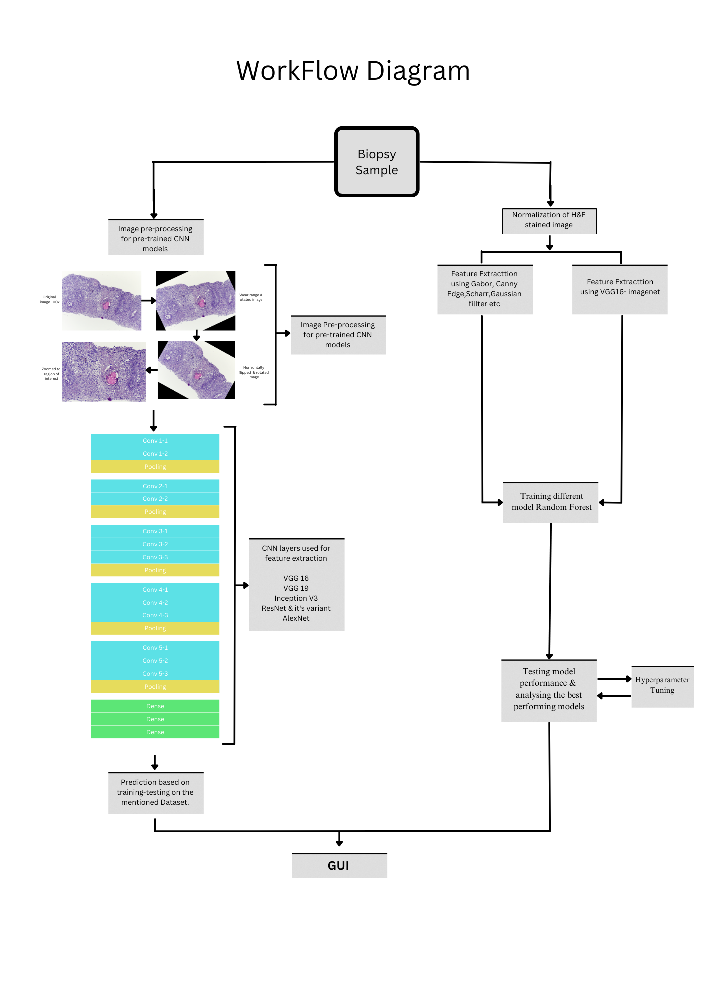

# Oral Squamous Cell Carcinoma:
This project demonstrates an how to detect OSCC with various CNN model, in addition to that we have proposed a semgentation model which to detect and segment cancerous cell from clinical slides.

## Publication details:
[link] (https://link.springer.com/chapter/10.1007/978-981-97-3604-1_4)

## Workflow of CNN classification:

Stages contain:
1. **imamge preprocessing**
2. **Feature Extraction**
3. **Feature Engineering**
4. **Model Training**
5. **Prediction**
6. **Model Registration**

---

## Workflow of proposed segmentation method
Stages contain:
1. **H&E stained images collection**
2. **Feature Extracttion using Gabor, Canny Edge,Scharr,Gaussian fillter etc**
3. **Fine tunning Random Forest model**
4. **Generating Segmentated Mask**
---

## 🛠 Tech Stack

| Area | Tool/Service |
|------|--------------|
| Programming | Python, Flask |
| Pipeline Orchestration | DVC |
| Model Tracking | MLflow |
| CI/CD | GitHub Actions |
| Data & Model Storage | AWS S3 |
| Containerization | Docker + AWS ECR |
| Deployment | AWS EKS |
| Monitoring | Prometheus + Grafana on EC2 |
